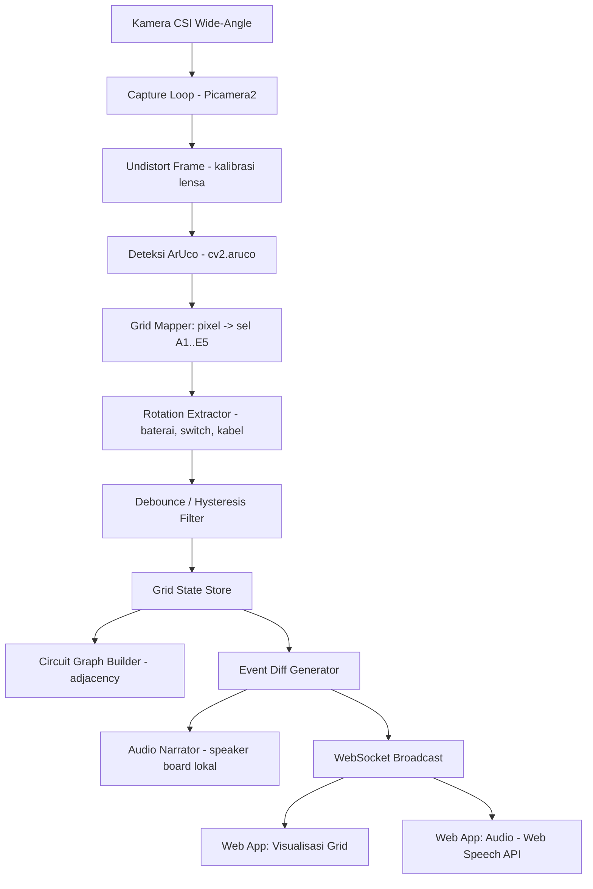

# PRD: LENTERA
### Papan Taktil Interaktif untuk Pembelajaran Rangkaian Listrik Dasar bagi Siswa Tunanetra

**Versi:** 0.1 (Draf awal — Fase 1/MVP)
**Status:** Untuk direview & dieksekusi oleh AI coding agent

---

## 1. Ringkasan & Latar Belakang

LENTERA adalah perangkat edukasi fisik yang memungkinkan siswa tunanetra menyusun rangkaian listrik dasar secara nyata (bukan simulasi digital), menggunakan blok komponen fisik yang diletakkan pada papan bergrid. Sistem komputer vision di dalam perangkat mendeteksi posisi dan jenis komponen yang diletakkan, lalu memberikan umpan balik audio kepada siswa serta visualisasi kepada pengamat (guru) melalui aplikasi web.

Perbedaan kunci dari pendekatan CV konvensional: kamera **diposisikan di bawah papan**, melihat ke atas melalui dasar slot yang transparan (akrilik bening), membaca marker ArUco yang tertempel di **bagian bawah** tiap blok komponen. Desain ini menghindari masalah oklusi tangan siswa yang biasa terjadi pada sistem kamera dari atas.

## 2. Tujuan Produk

- Memungkinkan siswa tunanetra membangun pemahaman rangkaian listrik dasar secara taktil dan mandiri.
- Memberikan umpan balik real-time (audio) atas apa yang mereka susun, tanpa bergantung pada penglihatan.
- Menyediakan kanal observasi visual (web) bagi guru/pendamping untuk memantau proses belajar.

## 3. Target Pengguna

| Pengguna | Kebutuhan |
|---|---|
| Siswa tunanetra (pengguna utama) | Interaksi 100% non-visual — taktil (blok fisik) + audio (speaker board & web) |
| Guru/pendamping | Observasi visual rangkaian secara real-time via web, tanpa mengganggu proses siswa |
| Pengembang (Fase lanjutan) | Akses ke roadmap belajar & data sesi untuk keperluan AI asisten |

## 4. Ruang Lingkup & Fase Pengembangan

| Fase | Scope | Status |
|---|---|---|
| **Fase 1 — MVP (dokumen ini)** | Deteksi posisi & jenis komponen real-time → bangun graf konektivitas → visualisasi bentuk rangkaian di web → narasi audio deskriptif → **evaluasi generik kelayakan rangkaian** (loop tertutup, status switch, deteksi korsleting) dengan feedback diagnostik spesifik (board + web). Belum ada pencocokan ke target/kunci jawaban lesson tertentu. | Target build sekarang |
| **Fase 2** | Pencocokan rangkaian terhadap kunci jawaban/target spesifik per lesson; kabel simpang 4-arah (cross); fungsi tombol panel depan | Backlog |
| **Fase 3** | Roadmap belajar terstruktur + AI asisten percakapan di web | Backlog |

Dokumen ini **fokus penuh ke Fase 1**. Fase 2 & 3 disebut sebagai konteks arah produk, bukan spesifikasi yang harus dibangun sekarang — lihat Bagian 16.

## 5. Spesifikasi Hardware

| Komponen | Spesifikasi |
|---|---|
| Komputer utama | Raspberry Pi 4B |
| Kamera | Modul kamera CSI wide-angle/fisheye (varian OV5647 wide-lens) — **FOV lebar wajib** karena kamera diposisikan cukup dekat di bawah grid 5×5 dan harus mencakup seluruh 25 slot dalam satu frame |
| Enclosure | Kotak papan LENTERA, grid 5×5 slot cekung di permukaan atas, speaker + 4 tombol + 1 knob di panel depan |
| Slot/pocket | 25 slot (label kolom A–E, baris 1–5, dicetak di keempat sisi papan), **dasar tiap slot berbahan akrilik transparan** agar kamera di bawah bisa membaca marker |
| Konektivitas | Wi-Fi hotspot lokal (tanpa internet) untuk akses web app dari laptop/perangkat guru |

## 6. Spesifikasi Board Fisik

- Grid tetap 5×5 (25 sel): kolom **A–E**, baris **1–5**.
- Setiap sel adalah slot fisik cekung berdasar akrilik bening.
- Blok komponen dimasukkan ke slot; marker ArUco tertempel di bagian bawah blok, menghadap kamera di bawahnya.
- Karena posisi grid **tetap dan diketahui**, sistem tidak memerlukan homografi dinamis per-frame — cukup kalibrasi satu kali di awal untuk memetakan tiap sel ke suatu Region of Interest (ROI) piksel pada citra kamera (lihat Bagian 14).

## 7. Komponen & Pemetaan Marker

Kamus marker: **`cv2.aruco.DICT_4X4_50`** (sudah divalidasi bekerja pada tahap eksperimen sebelumnya).

Untuk MVP, **7 jenis komponen** yang didefinisikan. Kabel dipecah jadi 3 bentuk (Lurus/Straight, Siku/L, Simpang-T) — masing-masing **1 ID + rotasi** (bukan blok statis terpisah per orientasi), karena orientasinya cukup diatur dengan memutar **seluruh blok fisik** saat diletakkan (tidak perlu mekanisme internal berputar seperti Switch):

| ID Marker | Komponen | Rotasi Bermakna? | Keterangan |
|---|---|---|---|
| 1 | Baterai | Ya — 2 state | Encode polaritas: 0°/180° = satu polaritas, 90°/270° = polaritas sebaliknya. Definisi pasti + vs − ditentukan saat kalibrasi fisik cetakan marker. |
| 2 | Kabel-Lurus (Straight) | Ya — 2 state | 0°/180° = menghubungkan **kiri-kanan** (horizontal), 90°/270° = menghubungkan **atas-bawah** (vertikal). Bentuk fisik simetris (batang lurus), jadi 0° dan 180° secara alami terlihat/teraba sama — tidak masalah karena keduanya sama-sama berarti "horizontal". |
| 3 | Kabel-Siku (L) | Ya — 4 state | Menghubungkan 2 sisi yang saling tegak lurus. 4 rotasi = 4 kombinasi sisi berbeda — lihat tabel lookup di Bagian 10. |
| 4 | Kabel-Simpang (T) | Ya — 4 state | Menghubungkan 3 dari 4 sisi (1 sisi tidak tersambung). 4 rotasi = 4 pilihan sisi mana yang dikecualikan — lihat tabel lookup di Bagian 10. |
| 5 | Lampu | Tidak | - |
| 6 | Resistor | Tidak | - |
| 7 | Switch | Ya — 2 state | Rotary toggle — 0°/180° = **OFF** (terputus), 90°/270° = **ON** (terhubung). Mekanisme: tuas fisik berputar dengan 2 *detent* (klik) yang memutar piringan marker **di dalam** blok (blok luar tetap diam di slot). |

**Kenapa Kabel pakai rotasi (1 ID per bentuk), padahal sebelumnya sempat diputuskan 2 ID statis?** Revisi dari keputusan sebelumnya. Insight kuncinya: rotasi kabel **tidak butuh mekanisme internal** seperti Switch, karena orientasi kabel cukup ditentukan dengan memutar **seluruh blok** saat siswa menaruhnya ke slot — bukan memutar komponen internal sambil blok tetap diam di tempat. Kekhawatiran R&D mekanik yang sempat saya angkat sebelumnya sebenarnya cuma berlaku untuk mekanisme SEPERTI SWITCH (rotasi internal, blok diam), bukan untuk rotasi seluruh blok saat penempatan. Dengan 3 bentuk fisik berbeda (Lurus/Siku/Simpang) yang mudah dibedakan secara taktil, total mold yang dibutuhkan tetap rendah (3 bentuk kabel + 4 komponen lain = 7 total) dibanding kalau tiap orientasi siku/simpang butuh mold terpisah.

**Catatan desain penting:** Baterai, Switch, Kabel-Lurus, Kabel-Siku, dan Kabel-Simpang **semuanya** memakai satu modul software yang sama untuk "baca sudut rotasi dari corner ArUco" (`get_marker_rotation_state(corners)`) — jangan duplikasi logika per komponen. Yang berbeda hanya jumlah state bermakna: Baterai/Switch/Kabel-Lurus memetakan ke **2 state logis** (bucket dipasangkan: 0°≡180°, 90°≡270°), sementara Kabel-Siku/Kabel-Simpang memetakan ke **4 state logis berbeda** (tidak ada pasangan yang searti) — detail di Bagian 9.1.

**Catatan kalibrasi:** kalibrasi grid ROI memakai deteksi kontur struktur pocket secara otomatis (lihat Bagian 14.2); blok komponen existing (ID 1–7) hanya dipakai sebagai titik acuan pada metode cadangan manual (Bagian 14.3) bila deteksi otomatis tidak andal. Tidak ada ID tambahan yang perlu direservasi.

## 8. Arsitektur Sistem



### Lapisan Sistem

1. **Perception Layer** — capture frame, undistort, deteksi ArUco (ID + corners).
2. **Grid Mapping Layer** — cocokkan tiap marker terdeteksi ke salah satu dari 25 ROI sel yang sudah dikalibrasi.
3. **Rotation Layer** — untuk Baterai, Switch, dan ketiga jenis Kabel (Lurus/Siku/Simpang), hitung sudut orientasi dari corner points, diskritisasi ke 2 atau 4 state tergantung jenis komponen (lihat Bagian 7 & 9.1).
4. **Stability Layer** — debounce: state sel baru dianggap valid hanya setelah stabil N frame berturut-turut (mengatasi jitter deteksi & sesaat tertutup tangan).
5. **Circuit Graph Layer** — bangun graf konektivitas dari grid state (lihat Bagian 10). Fase 1 hanya membangun graf, **belum** memvalidasi benar/salah.
6. **Output/Feedback Layer** — dua kanal paralel:
   - Audio lokal di board (TTS/pre-recorded, diputar dari speaker board)
   - WebSocket → web app (visualisasi + audio browser via Web Speech API)

## 9. Alur Data (Pipeline per Frame)

1. Ambil frame dari Picamera2 (target 20–24 FPS).
2. Deteksi semua marker ArUco langsung pada frame mentah (belum di-undistort) — lihat Bagian 9.2 untuk alasan strategi ini.
3. Untuk tiap marker terdeteksi: undistort titik corner-nya secara matematis (`cv2.fisheye.undistortPoints`), lalu hitung centroid dari titik yang sudah terkoreksi → cocokkan ke salah satu ROI sel (A1..E5) yang sudah dikalibrasi dalam ruang koordinat ter-undistort.
4. Untuk marker Baterai, Switch, dan ketiga jenis Kabel: hitung sudut rotasi dari corner yang **sudah ter-undistort** (bukan corner mentah — distorsi bisa mengubah sudut apparent, terutama di tepi FOV), diskritisasi ke kelipatan 90° terdekat.
5. Terapkan debounce: konfirmasi perubahan isi sel (terisi/kosong/berganti rotasi) hanya setelah stabil N frame (rekomendasi awal: ~8–10 frame berturut-turut, ekuivalen ±0.3–0.5 detik pada 20–24 FPS).
6. Update `grid_state` (struktur 25 sel).
7. Bangun ulang graf konektivitas dari `grid_state` terbaru menggunakan tabel lookup arah per jenis kabel (Bagian 10).
8. Evaluasi kelayakan rangkaian dari graf terbaru (Bagian 10.1) — hasilkan status (`no_battery`/`short_circuit`/`open_circuit`/`switch_off`/`success`/dst).
9. Bandingkan `grid_state` dan status rangkaian dengan hasil sebelumnya → hasilkan daftar event perubahan (`component_placed`, `component_removed`, `switch_toggled`, `circuit_status`, dst).
10. Kirim tiap event ke antrean Audio Narrator (Bagian 9.3) dan broadcast via WebSocket ke web app.

## 9.1 Detail Algoritma Debounce & Hysteresis

Debounce diperlukan di dua titik dengan karakteristik berbeda — keduanya digabung dalam satu mesin state per sel.

**A. Debounce Kehadiran Komponen (presence)**

Pola yang direkomendasikan: **asymmetric threshold** — konfirmasi "penempatan/perubahan" lebih cepat, konfirmasi "pelepasan" lebih lambat. Alasannya: siswa sering butuh beberapa saat menyetel posisi blok sampai pas (deteksi boleh langsung percaya begitu stabil), sedangkan pengangkatan blok biasanya aksi yang lebih definitif, tapi risiko marker sesaat tidak terbaca (blur, pantulan) lebih baik ditoleransi lebih lama sebelum dianggap benar-benar "dilepas".

```
PRESENCE_CONFIRM_FRAMES = 8   # ~360ms pada 22 FPS — penempatan/pergantian komponen
REMOVAL_CONFIRM_FRAMES  = 15  # ~680ms pada 22 FPS — pelepasan (lebih lama, hindari false-remove)

state per sel:
  confirmed        # state resmi saat ini (None atau {component, rotation})
  candidate        # state yang sedang diamati
  candidate_count  # berapa frame berturut-turut candidate ini konsisten

setiap frame, per sel:
  observed = hasil_deteksi_sel_ini_frame_ini()   # None jika kosong

  if observed == candidate:
      candidate_count += 1
  else:
      candidate = observed
      candidate_count = 1

  threshold = REMOVAL_CONFIRM_FRAMES if candidate is None else PRESENCE_CONFIRM_FRAMES

  if candidate_count >= threshold and candidate != confirmed:
      emit_event(cell, from=confirmed, to=candidate)
      confirmed = candidate
```

**B. Hysteresis Rotasi (Baterai, Switch, Kabel-Lurus, Kabel-Siku, Kabel-Simpang)**

Sudut mentah dari corner marker didiskritisasi ke kelipatan 90° terdekat, tapi di sekitar batas antar-kuadran (45°, 135°, 225°, 315°) diberi *dead zone* supaya sudut yang goyah tidak memicu perubahan candidate berulang kali:

```
ROTATION_DEADZONE_DEG = 20   # +/- 20 derajat di sekitar batas kuadran diabaikan

def discretize_rotation(raw_angle_deg, previous_bucket):
    nearest_bucket = round(raw_angle_deg / 90) * 90 % 360
    distance_to_boundary = min(abs(raw_angle_deg % 90), 90 - abs(raw_angle_deg % 90))
    if distance_to_boundary < ROTATION_DEADZONE_DEG:
        return previous_bucket   # masih dianggap sama seperti sebelumnya, tunda keputusan
    return nearest_bucket
```

Hasil `discretize_rotation` menghasilkan salah satu dari 4 bucket (0°/90°/180°/270°). **Pemetaan dari bucket ke state logis berbeda per jenis komponen:**
- Baterai, Switch, Kabel-Lurus: 2 state logis (bucket dipasangkan — 0°≡180°, 90°≡270°).
- Kabel-Siku, Kabel-Simpang: 4 state logis berbeda (tiap bucket = konfigurasi sambungan yang berbeda — lihat tabel lookup Bagian 10).

Hasil pemetaan inilah yang menjadi bagian dari `observed` pada algoritma debounce presence di atas — jadi perubahan rotasi (baik pergantian ON/OFF switch, maupun pergantian orientasi kabel) lewat alur debounce yang sama persis dengan perubahan kehadiran komponen.

**Catatan penting — beda karakter risiko antara Switch/Baterai vs Kabel:** mekanisme Switch/Baterai memakai *detent* fisik (klik 2 posisi) yang secara mekanik menahan sudut ke posisi yang jelas, jadi hasil baca kamera jarang berhenti persis di dead-zone. **Kabel (Lurus/Siku/Simpang) tidak punya detent** — orientasinya murni dari bagaimana siswa meletakkan seluruh blok ke slot, jadi berpotensi sedikit miring/tidak presisi 90° penuh. Untuk kabel, hysteresis dead-zone ini **bukan cuma lapisan tambahan, tapi mekanisme utama** untuk mentoleransi ketidakpresisian penempatan manual — pertimbangkan dead-zone yang lebih lebar khusus untuk kabel dibanding Switch/Baterai (perlu di-tuning terpisah saat uji lapangan).

## 9.2 Strategi Undistort: Point-Space vs Image-Space

Memanggil `cv2.undistort()` mentah-mentah tiap frame itu boros, karena secara default fungsi itu menghitung ulang peta distorsi tiap kali dipanggil. Ada dua strategi yang layak dibandingkan:

**Strategi A — Point-space undistort (dipilih sebagai default Fase 1):**
Deteksi ArUco langsung pada frame mentah (belum dikoreksi), lalu undistort hanya titik corner hasil deteksi (`cv2.fisheye.undistortPoints`) sebelum dicocokkan ke ROI grid maupun dipakai menghitung rotasi. Jauh lebih ringan dibanding memproses seluruh piksel gambar tiap frame.
- ⚠️ Risiko yang wajib diuji langsung di lensa fisik: distorsi fisheye yang parah bisa membuat bentuk marker melengkung di gambar mentah, sehingga algoritma deteksi ArUco (yang mencari kontur mendekati segi-empat) berpotensi gagal mendeteksi marker justru di sel-sel pojok grid (A1, A5, E1, E5) — area yang paling terdistorsi sekaligus paling kritis.

**Strategi B — Image-space undistort dengan peta pra-hitung (fallback bila Strategi A gagal validasi):**
Precompute peta distorsi SEKALI di awal (`cv2.fisheye.initUndistortRectifyMap`), lalu tiap frame cukup panggil `cv2.remap()` dengan peta yang sudah jadi — jauh lebih murah daripada `cv2.undistort()` naif, dan marker akan tampak sebagai segi-empat wajar di seluruh frame termasuk pojok, sehingga deteksi lebih andal di tepi FOV. Biaya tambahannya nyata tapi belum tentu fatal — wajib di-benchmark langsung di Pi 4B pada resolusi 640×480, bukan diasumsikan pasti menjatuhkan FPS ke bawah nilai target.

**Keputusan:** mulai dari Strategi A. Infrastruktur kalibrasi (peta distorsi dari Bagian 14.1) sama-sama dipakai di kedua strategi, jadi tidak ada kerja yang terbuang kalau nanti harus pindah ke Strategi B setelah pengujian fisik.

## 9.3 Antrean Audio & Pencegahan Penumpukan (Queue Design)

Pemanggilan TTS sinkron di loop utama akan memblokir seluruh pipeline deteksi — bukan cuma bikin audio delay, tapi berisiko menjatuhkan FPS juga. Desain yang dipakai:

- Audio Narrator berjalan sebagai **thread terpisah**, mengonsumsi event dari `queue.Queue` (thread-safe secara bawaan) yang diisi oleh Event Diff Generator (Bagian 9, langkah 9). Loop deteksi utama tidak pernah menunggu proses TTS selesai.
- **Kanal speaker board (siswa) — strategi ringkas, bukan buang:** karena ini satu-satunya jalur interaksi utama siswa tunanetra, event **tidak boleh dijatuhkan diam-diam**. Kalau antrean menumpuk (misal >2–3 event belum terucap saat event baru masuk), gabungkan jadi satu kalimat ringkasan (contoh: "Resistor dan kabel dilepas, baterai dipasang di A1") alih-alih memutar satu per satu berurutan yang bikin delay makin parah.
- **Kanal web app (guru) — boleh lebih longgar:** karena audio browser bersifat suplemen terhadap visualisasi grid yang sudah tampil real-time, kalau antrean menumpuk di sisi ini, cukup putar narasi untuk state TERBARU saja dan buang entri lama — guru tetap bisa menangkap konteks dari tampilan visual.
- Batasi ukuran antrean (`maxsize`, contoh 5) supaya kalau terjadi ledakan event yang sangat cepat, sistem tidak makin lama makin tertinggal jauh dari kondisi board yang sebenarnya.

## 10. Model Konektivitas Rangkaian

Setiap sel kabel membuka edge konektivitas hanya ke sisi-sisi tertentu, ditentukan oleh **jenis bentuk** (Lurus/Siku/Simpang) dan **state rotasi**-nya. Komponen non-kabel (Baterai, Lampu, Resistor, Switch) tetap terhubung ke **semua** tetangga terisi di 4 arah — hanya kabel yang punya batasan arah.

**Tabel lookup arah kabel** (konvensi sudut referensi ditentukan final saat kalibrasi fisik marker terhadap bentuk blok — angka di bawah ini ilustrasi pola, bukan nilai final):

| Jenis | Rotasi | Sisi yang terhubung |
|---|---|---|
| Kabel-Lurus | 0° / 180° | Kiri + Kanan (horizontal) |
| Kabel-Lurus | 90° / 270° | Atas + Bawah (vertikal) |
| Kabel-Siku | 0° | Atas + Kanan |
| Kabel-Siku | 90° | Kanan + Bawah |
| Kabel-Siku | 180° | Bawah + Kiri |
| Kabel-Siku | 270° | Kiri + Atas |
| Kabel-Simpang | 0° | Kiri + Kanan + Atas (Bawah tidak tersambung) |
| Kabel-Simpang | 90° | Atas + Bawah + Kanan (Kiri tidak tersambung) |
| Kabel-Simpang | 180° | Kiri + Kanan + Bawah (Atas tidak tersambung) |
| Kabel-Simpang | 270° | Atas + Bawah + Kiri (Kanan tidak tersambung) |

**Aturan pembentukan edge:** dua sel bertetangga (4-arah, tanpa diagonal) dianggap terhubung hanya jika **kedua sisi yang berhadapan sama-sama "dibuka"** oleh isi masing-masing sel pada sisi tersebut. Sel non-kabel selalu "membuka" ke semua 4 sisi. Sel kosong tidak membuka sisi manapun (memutus jalur).

**Ini menutup celah "korsleting virtual"** yang teridentifikasi pada model presence-only sebelumnya: dua baris Kabel-Lurus (horizontal) yang sejajar berdekatan tidak lagi otomatis dianggap terhubung, karena masing-masing hanya membuka sisi kiri-kanan, tidak ke atas-bawah.

**Keterbatasan yang masih ada (di luar scope Fase 1):** simpang 4-arah penuh (cross/"+", menghubungkan semua 4 sisi sekaligus) belum didukung sebagai satu blok tunggal — kalau dibutuhkan, siswa bisa mendekati efeknya dengan kombinasi 2 Kabel-Simpang berdekatan, atau ini didorong jadi backlog Fase 2 sebagai jenis kabel ke-4.

## 10.1 Evaluasi Kelayakan Rangkaian (Diagnostik)

**Update scope:** Fase 1 sekarang mencakup evaluasi generik "apakah rangkaian ini akan membuat lampu menyala" — lepas dari lesson/kunci jawaban manapun (pencocokan ke target lesson spesifik tetap Fase 2, lihat Bagian 16). Evaluasi ini berjalan tiap kali `grid_state` berubah, menghasilkan status + pesan diagnostik spesifik.

**Definisi status (urutan prioritas pelaporan):**
- `no_battery` — belum ada Baterai di board.
- `no_lamp` — belum ada Lampu di board.
- `not_connected` — Baterai dan Lampu ada, tapi tidak berada di komponen graf yang sama (tidak ada jalur apa pun di antara keduanya).
- `short_circuit` — ada loop tertutup dari Baterai kembali ke dirinya sendiri yang **hanya melewati kabel** (tanpa Lampu maupun Resistor di antaranya). **Prioritas laporan tertinggi** setelah cek dasar di atas — kondisi ini berbahaya, bukan sekadar "belum berhasil", jadi dilaporkan lebih dulu daripada status lain meski secara topologi "loop ada".
- `open_circuit` — Baterai dan Lampu terhubung, tapi tidak ada jalur manapun yang membentuk loop tertutup (ada ujung yang menggantung).
- `switch_off` — ada loop tertutup yang melewati Baterai + Lampu, tapi di **semua** kemungkinan jalur tersebut minimal satu Switch masih OFF. Laporkan jalur dengan Switch OFF paling sedikit (paling dekat ke berhasil), sebut koordinat sel switch-nya.
- `success` — ditemukan **minimal satu** loop tertutup yang memuat Baterai + Lampu dengan semua Switch di jalur itu ON.

**Algoritma (per evaluasi):**

```
def diagnose_circuit(grid_state, graph):
    batteries = cells_with_component(grid_state, 'baterai')
    lamps = cells_with_component(grid_state, 'lampu')

    if not batteries:
        return status('no_battery')
    if not lamps:
        return status('no_lamp')

    # topologi dasar: switch dianggap selalu "menyambung" dulu di tahap ini,
    # status ON/OFF-nya baru dicek belakangan per-loop
    g = build_graph(grid_state, treat_switch_as_always_connected=True)

    if not any_connected(batteries, lamps, g):
        return status('not_connected')

    # grid maksimal 25 sel -> pencarian loop brute-force (DFS/backtracking) cukup,
    # tidak perlu algoritma graf yang canggih
    loops = find_all_loops_through_battery(g, batteries)

    short_loops = [l for l in loops if not contains_any(l, ['lampu', 'resistor'])]
    if short_loops:
        return status('short_circuit', cells=short_loops[0].cells)

    loops_with_lamp = [l for l in loops if contains_any(l, ['lampu'])]
    if not loops_with_lamp:
        return status('open_circuit')

    # PENTING: cek SEMUA loop, bukan cuma yang pertama ditemukan --
    # kalau ADA satu saja jalur yang sepenuhnya valid, itu sudah cukup untuk "success"
    # walau ada jalur paralel lain yang switch-nya OFF
    for loop in loops_with_lamp:
        off_switches = [c for c in loop.cells if is_switch(c) and switch_state(c) == 'OFF']
        if not off_switches:
            return status('success')

    # tidak ada satupun loop yang sepenuhnya valid -> laporkan yang paling dekat
    best_loop = min(loops_with_lamp, key=lambda l: count_off_switches(l))
    off_switches = [c for c in best_loop.cells if is_switch(c) and switch_state(c) == 'OFF']
    return status('switch_off', cells=off_switches)
```

**Contoh event (masuk skema `event` yang sama seperti Bagian 12):**

```json
{
  "type": "circuit_status",
  "status": "switch_off",
  "cells": ["C3"],
  "narration": "Rangkaian belum menyala. Switch di C3 masih OFF."
}
```

```json
{
  "type": "circuit_status",
  "status": "short_circuit",
  "cells": ["A1", "B1", "C1"],
  "narration": "Peringatan, korsleting terdeteksi. Baterai terhubung langsung tanpa komponen di antaranya."
}
```

```json
{
  "type": "circuit_status",
  "status": "success",
  "narration": "Rangkaian berhasil, lampu menyala."
}
```

**Kapan event ini dikirim:** dievaluasi ulang tiap `grid_state` berubah, tapi event `circuit_status` hanya dikirim/diucapkan kalau **status-nya berubah** dari evaluasi sebelumnya — supaya tidak mengulang-ulang narasi yang sama tiap frame selagi siswa masih menyusun.

**Catatan scope:** ini evaluasi generik (rule-based, berlaku untuk susunan komponen apa pun) — bukan pencocokan ke rangkaian target spesifik yang ditentukan guru untuk suatu lesson (itu tetap Bagian 16 poin 3, Fase 2).

## 11. Spesifikasi Fitur MVP (Fase 1)

Yang **wajib** dibangun:

- [ ] Modul kalibrasi kamera (intrinsic + distortion coefficients untuk lensa wide-angle)
- [ ] Modul kalibrasi grid otomatis (deteksi kontur struktur pocket via `cv2.findContours` → urutkan ke grid A1–E5 → derive ROI → simpan `grid_roi.json`)
- [ ] Modul kalibrasi grid manual — fallback (script: operator taruh 4 blok komponen existing di A1/A5/E1/E5 → validasi geometris → hitung homografi → derive ROI, dipakai hanya jika metode otomatis gagal)
- [ ] Modul deteksi ArUco real-time dengan target 20–24 FPS stabil
- [ ] Modul point-space undistort (`cv2.fisheye.undistortPoints`, Strategi A Bagian 9.2) — fallback ke image-space remap (Strategi B) jika validasi fisik menunjukkan deteksi tidak andal di sel pojok
- [ ] Modul ekstraksi rotasi (dipakai bersama untuk Baterai, Switch, Kabel-Lurus, Kabel-Siku, Kabel-Simpang — lihat Bagian 7 & 9.1)
- [ ] Modul debounce/stability filter
- [ ] Modul circuit graph builder (adjacency 4-arah untuk komponen non-kabel; kabel memakai tabel lookup arah per jenis+rotasi — lihat Bagian 10)
- [ ] Modul evaluasi kelayakan rangkaian (Bagian 10.1) — deteksi `no_battery`/`no_lamp`/`not_connected`/`short_circuit`/`open_circuit`/`switch_off`/`success`, dengan pesan diagnostik spesifik per status
- [ ] Modul event diff generator
- [ ] Modul audio narator lokal (speaker board) — thread terpisah dengan bounded queue & strategi ringkas saat menumpuk (Bagian 9.3)
- [ ] Server WebSocket untuk broadcast grid state & event ke web app
- [ ] Web app minimal: render grid 5×5 + status tiap sel (kosong/isi komponen apa) secara real-time, status/badge kelayakan rangkaian terkini beserta pesan diagnostik, dan audio narasi via Web Speech API

Yang **eksplisit di luar scope Fase 1**:
- Pencocokan rangkaian terhadap kunci jawaban/target spesifik per lesson (evaluasi generik loop tertutup/korsleting SUDAH masuk scope — lihat Bagian 10.1)
- Fungsi tombol panel depan & knob
- Roadmap belajar & AI asisten di web
- Kabel simpang 4-arah penuh (cross/"+")

## 12. Spesifikasi Web App (Fase 1)

**Tujuan:** kanal observasi untuk guru — visualisasi + audio, tanpa fitur pengajaran/interaktif lain di tahap ini.

### Contoh skema data `grid_state` (dikirim via WebSocket)

```json
{
  "timestamp": "2026-09-22T13:05:00Z",
  "cells": {
    "A1": { "component": "baterai", "rotation": 0 },
    "A2": { "component": "kabel_lurus", "rotation": 0 },
    "B2": { "component": "kabel_siku", "rotation": 90 },
    "B1": null,
    "E5": { "component": "switch", "rotation": 90 }
  }
}
```

### Contoh skema `event` (dikirim tiap ada perubahan)

```json
{
  "type": "component_placed",
  "cell": "A1",
  "component": "baterai",
  "rotation": 0,
  "narration": "Komponen baterai diletakkan di koordinat A1"
}
```

```json
{
  "type": "switch_toggled",
  "cell": "E5",
  "state": "ON",
  "narration": "Switch di koordinat E5 dinyalakan"
}
```

- Audio di web app dipicu oleh field `narration` pada tiap event, diputar via **Web Speech API** browser (tidak perlu backend TTS terpisah untuk web — cukup kirim teks, browser yang bicara).
- Audio di board fisik tetap jalan independen (server lokal Pi memicu TTS/audio-nya sendiri) — **kedua kanal bicara bersamaan**, bukan salah satu saja.
- Visualisasi grid cukup berupa render sederhana 5×5 (HTML/SVG/Canvas), tiap sel menampilkan label komponen yang terdeteksi. Tidak perlu skema circuit-diagram elektronik formal di Fase 1.
- Tambahkan badge/indikator status kelayakan rangkaian yang menonjol (berdasarkan event `circuit_status` terbaru, Bagian 10.1) — terutama status `short_circuit` yang harus tampil mencolok (misal warna merah) karena sifatnya peringatan keamanan, bukan sekadar "belum selesai".

## 13. Non-Functional Requirements

| Aspek | Target |
|---|---|
| Frame rate deteksi | 20–24 FPS stabil |
| Latensi ujung-ke-ujung (perubahan fisik → narasi audio) | < 1 detik (termasuk window debounce) |
| Operasi offline | Wajib — seluruh komputasi on-device, tidak bergantung internet |
| Jaringan lokal | Rekomendasi: IP statis atau hostname mDNS (`lentera.local`) untuk akses web app yang konsisten, menghindari masalah DHCP berubah-ubah |
| Ketahanan mekanik | Slot & mekanisme rotary switch harus tahan pemakaian berulang ratusan kali/hari oleh banyak siswa |
| Pencahayaan internal | LED internal di dalam enclosure wajib ada dan konsisten, karena tidak ada cahaya alami masuk ke ruang di bawah papan |
| Waktu boot ke siap pakai | Target < 60 detik dari Pi selesai boot sampai audio "siap digunakan" terdengar (termasuk kalibrasi grid otomatis) — perlu diuji langsung di hardware final |

## 14. Kalibrasi Kamera & Setup Awal

Ada dua kalibrasi terpisah dengan sifat berbeda.

### 14.1 Kalibrasi Intrinsik Kamera (lensa) — one-time per unit kamera

Mengoreksi distorsi lensa wide-angle/fisheye. Ini **tidak realistis diotomatisasi penuh** karena butuh papan kalibrasi standar (chessboard/ChArUco) difoto dari berbagai sudut. Dilakukan sekali di tahap perakitan per unit kamera — gunakan `cv2.fisheye.calibrate` jika FOV > ~140°, atau `cv2.calibrateCamera` untuk FOV lebih moderat. Hasil (camera matrix + distortion coefficients) disimpan permanen ke `calibration.json`, dipakai terus selama kamera fisik tidak diganti.

### 14.2 Kalibrasi Grid ROI — otomatis via deteksi kontur struktur pocket (metode utama)

**Update dari foto prototipe fisik:** struktur dinding pembatas antar-pocket terlihat jelas dan konsisten dari bawah (kontras tegas antara plastik solid vs bukaan pocket), dan struktur ini **permanen** — bagian tetap dari cetakan tray, tidak berubah terlepas dari komponen apa yang diletakkan siswa. Ini membuka pendekatan kalibrasi otomatis penuh **tanpa perlu meminjam blok komponen maupun menambah hardware/marker baru** — struktur tray itu sendiri berfungsi sebagai "fiducial alami".

**Alur deteksi otomatis:**

1. Undistort frame (pakai hasil kalibrasi 14.1) — tetap wajib karena lensa wide-angle.
2. Threshold/edge detection untuk memisahkan struktur dinding plastik (solid, kontras) dari area bukaan pocket.
3. `cv2.findContours` untuk mendeteksi 25 bukaan pocket sebagai kontur individual.
4. `cv2.approxPolyDP` pada tiap kontur untuk menyederhanakan bentuknya (validasi mendekati bentuk oktagon/kotak sudut terpotong seperti terlihat di foto prototipe).
5. Filter kontur: buang yang terlalu kecil/besar/tidak wajar (noise, debu, pantulan) berdasarkan luas area & rasio aspek yang diharapkan.
6. Urutkan 25 kontur tersisa ke posisi grid A1–E5 (misal: kelompokkan berdasarkan koordinat Y jadi 5 baris, lalu urutkan tiap baris berdasarkan X jadi 5 kolom).
7. Simpan centroid + bounding area tiap kontur sebagai ROI sel tersebut ke `grid_roi.json`.

**Keunggulan dibanding kalibrasi manual:**
- Tidak perlu operator melakukan apa pun — bisa jalan otomatis tiap sistem start.
- Karena struktur dinding selalu ada (tidak tergantung ada/tidaknya blok di pocket), proses ini **bisa diulang otomatis secara berkala** (misal saat sistem idle) tanpa mengganggu sesi belajar — mendekati keunggulan fiducial permanen yang sempat dibahas sebelumnya, tanpa perlu menambah hardware apa pun.
- Tidak mengorbankan satu pun dari 25 sel aktif.

**Risiko yang perlu diuji langsung di prototipe fisik** (belum bisa dipastikan dari foto saja):
- Konsistensi pencahayaan internal sangat menentukan — bayangan tajam atau pantulan bisa mendistorsi bentuk kontur yang terdeteksi.
- Kalau hasil deteksi tidak tepat 25 kontur valid (kurang karena gagal terdeteksi, atau lebih karena noise terhitung sebagai kontur), sistem perlu logika retry atau otomatis jatuh ke metode cadangan (14.3).
- Belum tervalidasi pada tray versi 5×5 sebenarnya (foto yang ada baru versi contoh 3×4) — wajib diuji ulang begitu prototipe 5×5 fisik tersedia.

### 14.3 Kalibrasi Grid ROI — manual, memanfaatkan blok komponen yang sudah ada (metode cadangan)

Dipakai **hanya jika** deteksi kontur otomatis (14.2) terbukti tidak cukup andal di lapangan (pencahayaan tidak konsisten, tray kotor/aus, dsb) — bukan lagi metode utama, tapi tetap berguna sebagai jaring pengaman.

**Prosedur kalibrasi manual:**

1. Operator (guru/teknisi) menaruh **4 blok komponen apa saja yang sudah ada** (tidak perlu blok khusus baru) ke 4 sel sudut yang ditetapkan sebagai titik acuan: **A1, A5, E1, E5**. Bebas jenis komponen apa, asal ID-nya berbeda satu sama lain sehingga posisinya mudah dibedakan.
2. Jalankan skrip/mode kalibrasi (`calibrate_grid.py` atau sejenis — di Fase 2 bisa dipetakan ke salah satu tombol panel depan, lihat Bagian 16).
3. Sistem mendeteksi ke-4 marker tersebut, mencatat ID & posisi piksel centroid masing-masing.
4. Validasi geometris: cek apakah ke-4 titik itu membentuk bentuk quadrilateral yang masuk akal (tidak terlalu miring/terdistorsi) — kalau gagal, tolak dan minta ulang penempatan.
5. Hitung homografi `H` dari 4 pasangan titik (posisi grid diketahui: pusat sel A1, A5, E1, E5 ↔ posisi piksel terdeteksi) — `cv2.getPerspectiveTransform` atau `cv2.findHomography`.
6. Derive ROI untuk semua 25 sel dari `H`, simpan ke `grid_roi.json`.
7. Operator melepas ke-4 blok kalibrasi tersebut, mengembalikannya ke penggunaan normal. Sistem siap dipakai untuk sesi belajar — seluruh 25 sel tetap tersedia penuh.

**Re-kalibrasi manual:** dipicu operator kapan pun dicurigai kamera bergeser dan metode otomatis (14.2) gagal memberi hasil yang wajar.

## 15. Risiko & Mitigasi

| Risiko | Dampak | Mitigasi |
|---|---|---|
| Distorsi lensa wide-angle di tepi grid | Deteksi ID/posisi tidak akurat di sel pinggir (A1, E1, A5, E5) | Wajib kalibrasi intrinsik (Bagian 14), jangan pakai frame mentah |
| Glare dari pantulan LED internal di permukaan akrilik | Marker gagal terbaca sesaat | Atur posisi LED tidak menghadap langsung ke kamera, gunakan diffuser jika perlu |
| Goresan akrilik seiring waktu | Akurasi menurun perlahan | Rencanakan kalibrasi ulang berkala, pertimbangkan material akrilik anti-gores |
| Rotasi Switch/Baterai/Kabel berhenti di sudut ambigu (mis. 45°) | State/orientasi salah baca atau "kedip" | Switch/Baterai punya *detent* fisik jadi risiko rendah; Kabel (tanpa detent) lebih rentan — perlu dead-zone hysteresis lebih lebar khusus kabel (Bagian 9.1) |
| Siswa kesulitan membedakan 3 bentuk Kabel (Lurus/Siku/Simpang) atau salah memutar orientasinya secara taktil | Circuit graph salah tanpa disadari siswa/guru | Pastikan tiap bentuk kabel punya profil raba yang jelas berbeda; wajib uji langsung dengan siswa tunanetra untuk validasi kemudahan orientasi |
| Kalibrasi/kamera gagal saat boot, tidak ada monitor untuk diagnosis | Siswa/guru tidak tahu kenapa alat tidak merespons | Wajib audio unmistakable saat gagal (Bagian 18.2) + logging persisten via journalctl (Bagian 18.4) untuk diagnosis jarak jauh |
| Debounce terlalu pendek | Flicker antar state saat transisi | Window debounce ~8–10 frame, sesuaikan setelah uji lapangan |
| Debounce terlalu panjang | Terasa lambat merespons ke siswa | Perlu tuning, target latensi <1 detik (Bagian 13) |
| Thermal throttling Pi 4B pada beban CPU tinggi terus-menerus | FPS turun diam-diam tanpa error | Pastikan pendingin (heatsink/kipas) memadai di dalam enclosure |
| IP dinamis (DHCP) pada hotspot lokal | Web app terputus akses tiap IP berubah | Gunakan IP statis atau mDNS hostname |
| Marker kotor/berdebu akibat pemakaian bergantian banyak siswa | Deteksi gagal intermiten | Pertimbangkan mekanisme pembersihan berkala atau marker dengan lapisan pelindung |
| Deteksi kontur pocket gagal/tidak konsisten (pencahayaan tidak stabil, tray kotor/aus) | ROI meleset atau jumlah kontur terdeteksi tidak tepat 25 | Fallback otomatis ke metode kalibrasi manual (Bagian 14.3) jika deteksi kontur gagal N kali berturut-turut; pastikan pencahayaan internal konsisten |
| Pencarian loop (Bagian 10.1) pada rangkaian dengan banyak jalur paralel bisa lambat/kompleks kalau siswa membangun banyak cabang sekaligus | Evaluasi kelayakan rangkaian delay atau salah diagnosis | Grid maksimal 25 sel jadi ruang pencarian tetap kecil (brute-force DFS cukup); tetap wajib diuji dengan skenario board penuh untuk pastikan latensi evaluasi tidak mengganggu Bagian 13 |

## 16. Item Terbuka / Belum Diputuskan

Item berikut **sengaja tidak dispesifikasikan** dalam dokumen ini dan perlu didiskusikan terpisah sebelum masuk ke roadmap implementasinya:

1. **Fungsi 4 tombol merah + 1 knob** di panel depan — belum didesain fungsinya (kandidat: cek rangkaian, ulangi, bantuan, volume, navigasi lesson).
2. **Kabel simpang 4-arah penuh (cross/"+")** (Fase 2) — Fase 1 sudah mendukung Lurus/Siku/Simpang-T (Bagian 7 & 10), tapi sambungan yang menghubungkan sekaligus ke 4 sisi dalam satu blok belum didukung.
3. **Pencocokan rangkaian ke target/kunci jawaban spesifik per lesson** (Fase 2) — berbeda dari evaluasi generik "akan menyala atau tidak" yang sudah masuk Fase 1 (Bagian 10.1); ini soal apakah susunan siswa PERSIS sesuai yang dimaksud guru untuk suatu pelajaran tertentu (misal "harus pakai 1 resistor di jalur ini"). Siapa yang mendefinisikan target, format datanya, dan lewat interface apa (web builder untuk guru?) — belum diputuskan.
4. **Roadmap belajar & AI asisten** (Fase 3) — belum dibahas sama sekali, perlu sesi desain terpisah.

## 17. Referensi Implementasi Dasar

Kode berikut sudah terbukti berjalan pada tahap eksperimen sebelumnya dan bisa jadi titik tolak (bukan kode final, perlu direstrukturisasi mengikuti arsitektur Bagian 8):

- Setup kamera: `Picamera2` dengan `create_video_configuration({"size": (640, 480)})`.
- Deteksi ArUco: `cv2.aruco.getPredefinedDictionary(cv2.aruco.DICT_4X4_50)` + `cv2.aruco.ArucoDetector`.
- Pola streaming non-blocking terbukti stabil 20–24 FPS: capture loop di thread terpisah, encode frame ke JPEG in-memory (`cv2.imencode`), simpan ke variabel bersama dengan `threading.Lock`, hindari `cv2.imwrite` berulang ke kartu SD (I/O bottleneck).
- **Catatan:** implementasi sebelumnya menggunakan HTTP server sederhana untuk MJPEG preview. Untuk Fase 1 ini, ganti/tambahkan dengan **WebSocket server** yang mem-broadcast `grid_state` dan `event` terstruktur (JSON), bukan cuma video mentah.

## 18. Deployment & Auto-Start (Systemd)

Supaya board LENTERA benar-benar "nyala langsung siap pakai" tanpa perlu SSH manual tiap kali dipakai, program utama dijadikan **systemd service** yang start otomatis saat boot.

### 18.1 Systemd Service

Contoh unit file (`/etc/systemd/system/lentera.service`):

```ini
[Unit]
Description=LENTERA Circuit Detection Service
After=network.target
Wants=network.target

[Service]
Type=simple
ExecStart=/usr/bin/python3 /home/pilentera/lentera_cv/main.py
WorkingDirectory=/home/pilentera/lentera_cv
Restart=on-failure
RestartSec=5
User=pilentera
StandardOutput=journal
StandardError=journal

[Install]
WantedBy=multi-user.target
```

```bash
sudo systemctl daemon-reload
sudo systemctl enable lentera.service
sudo systemctl start lentera.service
```

**Catatan penting:** `ExecStart` wajib memakai interpreter Python **absolut** yang sama dengan yang sudah terbukti punya `picamera2`/`opencv` terpasang (Python sistem — venv sebelumnya sudah dihapus dari alur proyek ini). Jangan asumsikan environment SSH manual otomatis terbawa ke service — ini persis jebakan "Environment Loss" yang sempat diidentifikasi di eksplorasi awal proyek. `Restart=on-failure` memastikan program otomatis mencoba lagi kalau crash, tanpa butuh intervensi manual.

### 18.2 Urutan Startup & Konfirmasi Audio "Siap Digunakan"

Karena pengguna utama tidak bisa melihat indikator visual (lampu status, layar boot), `main.py` wajib memberi **konfirmasi audio** di tiap tahap penting, bukan diam saat berhasil maupun gagal:

1. Inisialisasi kamera (Picamera2).
2. Jalankan kalibrasi grid otomatis (Bagian 14.2) — retry beberapa kali dengan jeda singkat jika gagal di percobaan pertama (kamera/pencahayaan kadang butuh waktu stabil).
3. **Jika kalibrasi berhasil:** putar audio "LENTERA siap digunakan" di speaker board, masuk ke loop deteksi utama.
4. **Jika kalibrasi gagal setelah beberapa retry:** putar audio yang jelas menyatakan masalah (misal "Kalibrasi gagal, mohon panggil guru atau pendamping") — jangan biarkan sistem diam tanpa penjelasan, karena siswa tunanetra tidak punya cara lain untuk tahu ada masalah. Log kegagalan untuk didiagnosis nanti (Bagian 18.4).

### 18.3 Jaringan: Pi Sebagai Access Point Mandiri (Rekomendasi)

Setup pengembangan saat ini bergantung pada hotspot eksternal (laptop/HP) dengan IP yang bisa berubah (sempat berubah dari `.234` ke `.80` di sesi sebelumnya). Untuk unit yang benar-benar dipakai di kelas dan harus "nyala = siap", ini sebaiknya **tidak** bergantung pada hotspot orang lain menyala atau tidak. Rekomendasi: konfigurasi Raspberry Pi sebagai **Access Point mandiri** (`hostapd` + `dnsmasq`), dengan SSID & IP tetap.

Konsekuensinya: guru tinggal menyambungkan laptop/HP ke WiFi LENTERA sendiri, dan alamat WebSocket selalu konsisten — sekaligus menutup risiko "IP dinamis" yang sudah ditandai di Bagian 15. Ini keputusan konfigurasi satu kali saat instalasi, bukan sesuatu yang diulang tiap boot — begitu `hostapd` di-enable sebagai service sistem, ia ikut start otomatis bersama `lentera.service` di atas.

### 18.4 Logging untuk Debugging Tanpa Monitor

Karena unit produksi kemungkinan tidak akan disambungkan ke monitor/keyboard sehari-hari, andalkan:
- `journalctl -u lentera.service` — log otomatis dari systemd (termasuk rotasi log bawaan), bisa ditarik lewat SSH kapan saja saat troubleshooting.
- Pertimbangkan menulis event kritis (gagal kalibrasi, kamera tidak terdeteksi, dst) ke file log terpisah yang persisten, supaya guru/teknisi bisa melaporkan masalah dengan detail jelas tanpa harus mereproduksi masalahnya secara langsung.

---

## Lampiran: Daftar Istilah

- **Grid state**: representasi lengkap isi 25 sel pada suatu waktu.
- **Debounce**: penundaan konfirmasi perubahan state sampai stabil beberapa frame, untuk menghindari flicker akibat noise deteksi.
- **ROI (Region of Interest)**: area piksel pada citra yang mewakili satu sel grid fisik.
- **Rotation state**: sudut orientasi marker (didiskritisasi ke kelipatan 90°) yang membawa informasi tambahan selain identitas komponen (mis. polaritas baterai, status switch).
